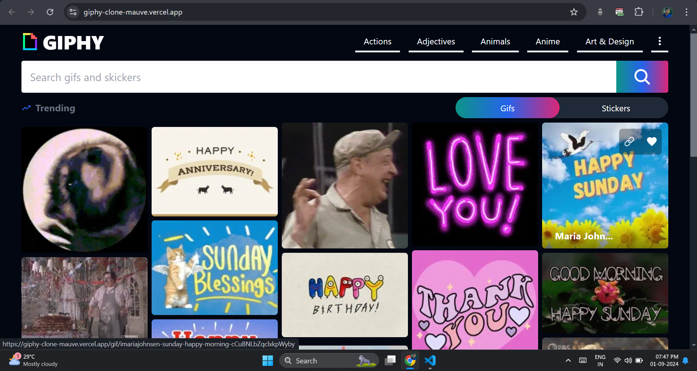
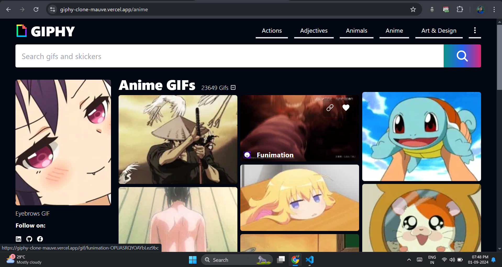
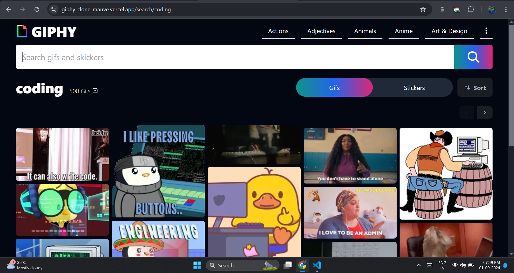
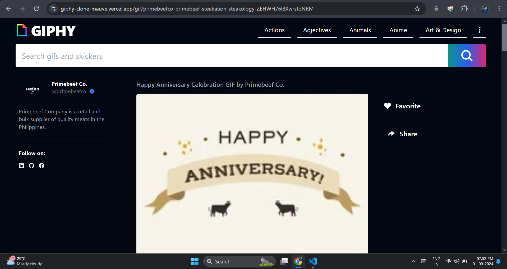
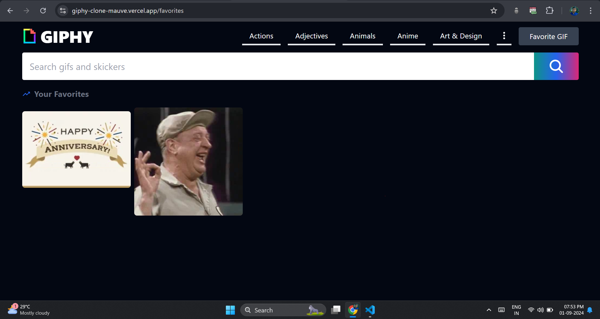

<div align="center">
    
    <h1>Giphy Clone</h1>
</div>

A feature-rich Giphy clone built with React.js, allowing users to browse, search, and manage their favorite GIFs. This project mimics the functionality of the popular Giphy platform, with custom features to enhance user experience.📷

## Features

- Multiple pages including Home, Search, Favorite GIFs, Category, and Single GIF pages with routing and navigation.
- Displays trending GIFs on the Home page with options to copy the GIF's link, add to Favorites, and see the uploader's profile when hovering over a GIF.
- Sort GIFs by type (GIFs or Stickers) on the Home page.
- Search bar in the header to find GIFs by keyword, with sorting options for type, relevance, or recency, and pagination to browse through results.
- Single GIF page displays the selected GIF along with the uploader's username, related GIFs, and tags, with links to view GIFs from related categories.
- Browse GIFs within specific categories (e.g., Anime) and search within the category.
- Save GIFs to your Favorites list, manage Favorites, and retrieve them from local storage with Favorites button visible in the Navbar.
- Error handling using React Error Boundary.
- Inplement lazy componet loading and suspence.

## Preview Images 

### Home Page


### Categories Page


### Search Page


### Single Gif Page


### Favorite Page


## Technologies Used

- React.js
- React Router 
- React Query 
- Context API
- React Icons
- React Error Boundary 
- Giphy API
- Local Storage

## Installation

1. Clone the repository:
   ```bash
   git clone https://github.com/ManikMaity/Giphy-Clone.git
   cd giphy-clone
   ```
   
2. Install the dependencies:
   ```bash
   npm install
   ```
   
3. Start the development server:
   ```bash
   npm run dev
   ```

4. Open your browser and navigate to `http://localhost:5173/` to view the app.

## Usage

- Home Page: Browse trending GIFs, hover for more options, and sort by type.
- Search GIFs: Use the search bar to find specific GIFs, sort results, and browse through pages.
- Single GIF View: Click on a GIF to view more details, related GIFs, and tags.
- Categories: Explore GIFs by category and search within a specific category.
- Favorites: Manage your list of favorite GIFs, with all actions stored in local storage.

## Future Enhancements

- User Authentication
- Infinite Scrolling
- Share Functionality
- Clean Code
- Search Suggestion
